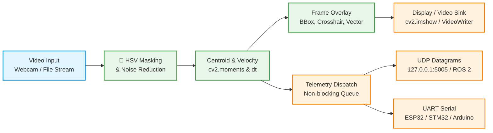

# Vision Target Tracker Engine

[](https://github.com/Mastarmynde001/vision-target-tracker/actions/workflows/ci.yml)
[](https://www.python.org/)
[](https://opensource.org/licenses/MIT)
[](https://github.com/astral-sh/uv)
[](./tests)

A high-performance, real-time computer vision target tracking engine built in Python using OpenCV, NumPy, and Pytest. Managed via [`uv`](https://github.com/astral-sh/uv).

`vision-target-tracker` performs color-based target segmentation in HSV color space, Gaussian blur and morphological noise reduction, contour analysis, moment-based centroid extraction (`cv2.moments`), 2D velocity vector tracking, rolling average FPS/latency profiling, and non-blocking asynchronous telemetry broadcasting over UDP datagram sockets and UART serial lines.

---

## Architecture & Processing Pipeline



---

## Key Features

- **HSV Color Segmentation & Filtering**: Configurable lower and upper HSV threshold boundaries with noise reduction via Gaussian blurring and morphological opening/closing operations.
- **Sub-Pixel Centroid & Bounding Box Localization**: Image moments (`cv2.moments`) to derive precise centroid coordinates $(x, y)$ and bounding box rectangles $(x, y, w, h)$.
- **2D Velocity Vector Estimation**: Inter-frame displacement calculations to compute real-time pixel velocity vectors $(vx, vy)$.
- **Non-Blocking Asynchronous Telemetry**: Low-latency telemetry broadcasting over UDP datagrams (`UDPTelemetryBroadcaster`) and UART serial interfaces (`SerialTelemetryBroadcaster`) using daemon worker threads (`queue.Queue`) without dropping video processing framerates (< 5μs enqueue time).
- **Rolling Benchmark Profiler**: `FPSBenchmark` supports context manager syntax (`with benchmark:`), function decorators (`@benchmark`), and manual frame timing with rolling FPS and latency (ms) metrics.
- **Visual Overlay Utilities**: Drawing routines for bounding boxes, target crosshairs, directional velocity arrows (`cv2.arrowedLine`), performance overlays, and dual-view side-by-side mask composites.
- **Flexible CLI Entrypoint**: Interactive stream parsing for live webcams (`cv2.VideoCapture`), video files, telemetry hardware parameters, headless test runs, and video exporting.
- **Deterministic Pytest Suite & QA Audit**: Synthetic frame unit tests validating centroid detection accuracy (<= 2px target error), socket telemetry schema, and non-blocking queue eviction.

---

## Real-World Applications & Use Cases

### Robotics & Autonomous Navigation
* **Visual Docking**: Guiding a rover or drone toward a specific color-coded charging pad or landing pad.
* **Line & Landmark Following**: Calculating offset vectors from the frame center to generate steering control signals (e.g., PID error inputs).
* **Pan-Tilt Camera Mount Control**: Sending the calculated target centroid $(x, y)$ over Serial/UART to microcontrollers (ESP32, STM32, or Arduino) to drive pan-tilt servos that keep the object locked in the center of the frame.

### Industrial Automation & Sorting
* **Conveyor Belt Sorting**: Tracking color-coded items passing along a conveyor belt and calculating velocity vectors to trigger mechanical actuators at the precise intercept time.

### Security & Perimeter Monitoring
* **Target Acquisition**: Isolating moving visual targets within a designated region of interest (ROI) and triggering telemetry logs or alerts when a target breaches boundary zones.

---

## Project Structure

```
vision-target-tracker/
├── tracking_engine/
│   ├── __init__.py         # Package exports
│   ├── core.py             # ObjectTracker class & TrackedTarget dataclass
│   ├── benchmark.py        # FPSBenchmark rolling latency/FPS profiler
│   ├── telemetry.py        # UDPTelemetryBroadcaster & SerialTelemetryBroadcaster
│   └── utils.py            # Drawing overlays & composite view helpers
├── scripts/
│   └── listen_telemetry.py # Terminal receiver utility to listen & view live UDP telemetry
├── tests/
│   ├── __init__.py         # Test package initialization
│   ├── test_core.py        # Synthetic frame centroid accuracy & benchmark tests
│   ├── test_telemetry.py   # Mock UDP socket listener, schema & fallback tests
│   └── test_utils.py       # Overlay drawing & side-by-side composite tests
├── main.py                 # CLI stream parser entrypoint with telemetry flags
├── pyproject.toml          # Build metadata & dependency configuration (uv / hatchling)
├── README.md               # Complete architecture & usage documentation
├── ARCHITECTURE.md         # Detailed architectural specification contract
├── TELEMETRY_SPEC.md       # Hardware and network telemetry protocol spec
├── QA_AUDIT.md             # Systems validation & quality assurance audit report
├── SECURITY_AUDIT.md       # Security, privacy & path-sanitization report
└── .github/workflows/
    └── ci.yml              # Automated GitHub Actions test matrix across Python 3.10+
```

---

## Quickstart & Installation

This project uses [`uv`](https://github.com/astral-sh/uv) for fast, deterministic Python environment and dependency management.

### 1. Prerequisites

- Python `>= 3.10`
- `uv` installed ([uv installation guide](https://github.com/astral-sh/uv)):
  ```bash
  curl -LsSf https://astral.sh/uv/install.sh | sh
  ```

### 2. Setup Virtual Environment & Install Dependencies

```bash
# Clone the repository
git clone https://github.com/your-username/vision-target-tracker.git
cd vision-target-tracker

# Create virtual environment and install in editable mode with dev dependencies
uv venv
source .venv/bin/activate
uv pip install -e .[dev]
```

---

## Commands & Usage Examples

### 1. Live Webcam Tracking

Track objects in real-time from the default system webcam (`--source 0`):

```bash
uv run main.py --source 0
```

### 2. Video File Processing

Track targets within an existing video file:

```bash
uv run main.py --source path/to/sample_video.mp4
```

### 3. UDP Telemetry Broadcasting

Broadcast real-time target coordinates $(x, y)$, velocity $(vx, vy)$, and FPS over non-blocking UDP sockets (default: `127.0.0.1:5005`):

```bash
uv run main.py --source 0 --udp-ip 127.0.0.1 --udp-port 5005
```

### 4. Live UDP Telemetry Receiver Utility

In a separate terminal, launch the receiver script to visualize incoming UDP telemetry datagrams live:

```bash
# Listen on default 127.0.0.1:5005
python3 scripts/listen_telemetry.py

# Custom IP and port
python3 scripts/listen_telemetry.py --ip 127.0.0.1 --port 5005
```

### 5. Microcontroller Serial UART Telemetry

Stream JSON telemetry lines over UART serial ports to hardware microcontrollers:

```bash
uv run main.py --source 0 --serial-port /dev/ttyUSB0 --baudrate 115200
```

### 6. Custom HSV Color Tuning & Area Filter

Customize HSV color boundaries and minimum pixel area thresholds:

```bash
# Track bright green objects
uv run main.py --source 0 --hsv-lower 35 50 50 --hsv-upper 85 255 255 --min-area 300

# Track bright white targets
uv run main.py --source 0 --hsv-lower 0 0 200 --hsv-upper 180 30 255 --min-area 100
```

### 7. Headless Benchmarking & CI Runs

Run stream processing in headless mode without opening GUI display windows:

```bash
uv run main.py --source 0 --no-display --max-frames 200
```

### 8. Export Processed Video

Save the annotated video stream directly to an MP4 video file:

```bash
uv run main.py --source 0 --output tracked_output.mp4 --max-frames 300
```

---

## Testing & Verification

Run the automated test suite with `pytest` via `uv`:

```bash
# Run unit tests
uv run pytest

# Run unit tests with verbose output
uv run pytest -v
```

### Test Coverage Highlights:

- **Centroid Accuracy**: Validates centroid localization against synthetic white circles centered at `(100, 100)` ensuring <= 2px error.
- **Bounding Box Verification**: Asserts contour bounding box $(x, y, w, h)$ accuracy.
- **Velocity Vector Verification**: Asserts 2D velocity displacement calculations $(vx, vy)$ across sequential frames.
- **Telemetry Schema & UDP Socket Listener**: Spins up a local loopback UDP socket listener to validate JSON datagram keys and centroid tolerances.
- **Queue Overflow Eviction**: Tests non-blocking queue eviction under rapid 20-packet bursts (< 5ms enqueue latency).
- **Serial Fallback Safety**: Asserts graceful fallback when serial ports are missing or unreadable.
- **Benchmark Profiler**: Validates `FPSBenchmark` context manager, decorator interface, rolling FPS calculations, and latency metrics.

---

## Hardware & System Integration

### JSON Telemetry Payload Contract

Every detected target emits a lightweight JSON packet:

```json
{
  "timestamp": 1771670400.125,
  "frame_id": 1420,
  "target_id": 1,
  "centroid_x": 320,
  "centroid_y": 240,
  "velocity_x": 12.5,
  "velocity_y": -3.2,
  "fps": 58.4
}
```

### Downstream Integrations:

1. **ESP32 / STM32 / Arduino (Pan-Tilt Servo Mounts)**:
   - Connect camera to host and microcontroller via USB/UART.
   - Stream telemetry using `--serial-port /dev/ttyUSB0 --baudrate 115200`.
   - Microcontroller computes PID tracking errors $(e_x = \text{centroid}_x - W/2, e_y = \text{centroid}_y - H/2)$ and drives pan-tilt servos to center the target.

2. **ROS 2 Nodes**:
   - Ingest JSON UDP packets from `127.0.0.1:5005` in a ROS 2 node.
   - Publish to standard ROS topics (e.g., `geometry_msgs/msg/PointStamped` or `vision_msgs/msg/Detection2D`).

3. **Ground Control Stations (GCS)**:
   - Transmit UDP telemetry packets over wireless networks (Wi-Fi / telemetry radios) to monitor target lock, tracking coordinates, and velocity telemetry in real-time.

---

## Documentation & Specifications

- **[ARCHITECTURE.md](./ARCHITECTURE.md)**: Architectural specifications, class structures, and module contracts.
- **[TELEMETRY_SPEC.md](./TELEMETRY_SPEC.md)**: Hardware and network telemetry protocol specifications.
- **[QA_AUDIT.md](./QA_AUDIT.md)**: Systems validation and quality assurance audit report.
- **[SECURITY_AUDIT.md](./SECURITY_AUDIT.md)**: Security, privacy, and path-sanitization audit report.
- **[.github/workflows/ci.yml](./.github/workflows/ci.yml)**: GitHub Actions automated test matrix across Python `3.10`, `3.11`, and `3.12`.

---

## 📄 License

This project is licensed under the [MIT License](./pyproject.toml).