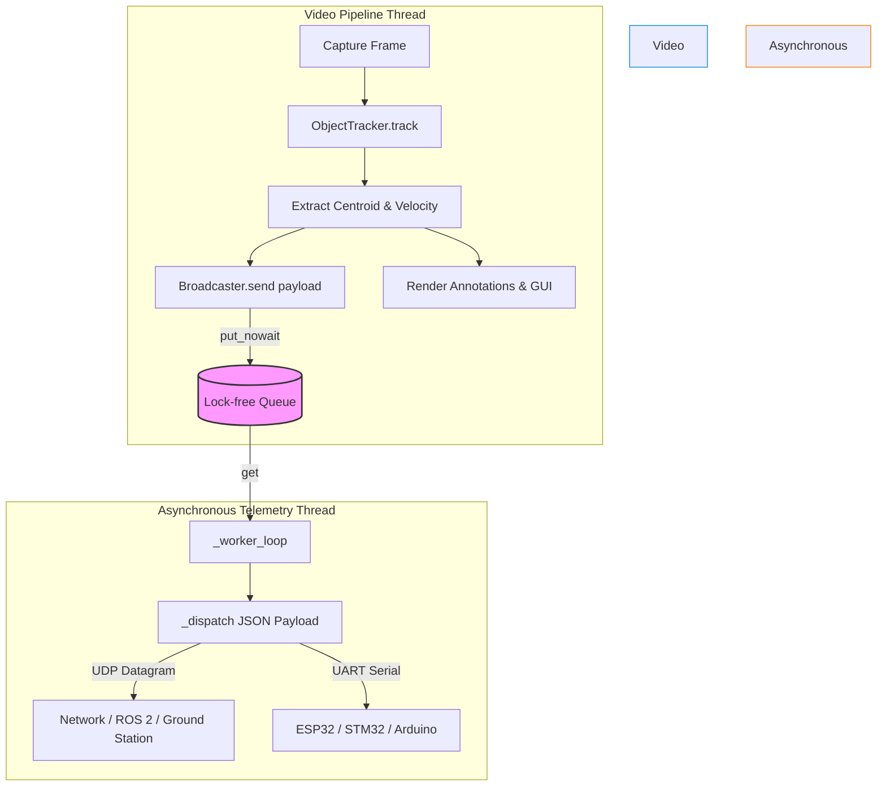

# Telemetry Specification & Hardware Communication Contract

This specification defines the hardware and network telemetry layer for broadcasting target tracking telemetry packets to downstream systems, microcontrollers (ESP32, STM32, Arduino), ROS 2 nodes, or ground control stations.

---

## 1. JSON Payload Contract

Telemetry packets are formatted as lightweight, UTF-8 encoded JSON objects transmitted over UDP datagram sockets or UART serial lines.

### 1.1 Schema Definition

| Field Name | Data Type | Units / Format | Description |
| :--- | :--- | :--- | :--- |
| `timestamp` | `float` | Seconds (epoch `time.time()`) | Unix timestamp when the frame was captured. |
| `frame_id` | `integer` | Count (`>= 0`) | Monotonically increasing video frame index. |
| `target_id` | `integer` | Count (`>= 0`) | Unique tracking identifier assigned to target. |
| `centroid_x` | `integer` | Pixels (`0 .. W-1`) | X-coordinate of target centroid relative to top-left. |
| `centroid_y` | `integer` | Pixels (`0 .. H-1`) | Y-coordinate of target centroid relative to top-left. |
| `velocity_x` | `float` | Pixels / Second | Estimated target horizontal velocity component $v_x$. |
| `velocity_y` | `float` | Pixels / Second | Estimated target vertical velocity component $v_y$. |
| `fps` | `float` | Hz (Frames / Sec) | Current rolling average processing frame rate. |

### 1.2 Example JSON Telemetry Packet

```json
{
  "timestamp": 1771670400.125,
  "frame_id": 1420,
  "target_id": 1,
  "centroid_x": 320,
  "centroid_y": 240,
  "velocity_x": 12.5,
  "velocity_y": -3.2,
  "fps": 58.4
}
```

---

## 2. Non-Blocking Asynchronous Dispatch Architecture

To maintain high video frame rates (e.g. 60+ FPS), socket I/O and serial UART writes are offloaded to dedicated daemon threads using an asynchronous lock-free `Queue`.



### Key Performance Guarantees:

1. **Zero Thread Blocking**: `Broadcaster.send()` uses `queue.put_nowait()`, returning in `< 5 microseconds`.
2. **Backpressure Relief**: If network I/O or serial baud rates experience latency spikes, the queue drops stale packets (`queue.get_nowait()`), prioritizing current real-time telemetry over historical frame backlogs.
3. **Graceful Degradation**: Network socket errors or serial connection drops do not crash the primary vision processing loop.
